# Справочная система управления фабриками, участками и оборудованием

## 1. Описание проекта

Веб-приложение для управления иерархической структурой производственных предприятий. Система позволяет создавать, редактировать и отслеживать связи между фабриками, производственными участками и оборудованием.

### Основные возможности:

- **Управление справочниками** - CRUD операции для фабрик, участков и оборудования
- **Иерархические связи** - визуализация родительско-дочерних связей любого уровня вложенности
- **Гибкие связи M:N** - оборудование может принадлежать нескольким участкам одновременно
- **Журнал событий** - полный аудит всех действий пользователей
- **Аутентификация** - регистрация и вход пользователей с хешированием паролей
- **Адаптивный интерфейс** - Bootstrap 5

### Технологический стек:

| Компонент | Технология |
|-----------|------------|
| Backend | Python + Flask |
| База данных | SQLite |
| ORM | SQLAlchemy |
| Аутентификация | Flask-Login |
| Frontend | Bootstrap 5, Jinja2, Bootstrap Icons |
| Логирование | SQLAlchemy (кастомные события) |

---

## 2. Инструкция по установке и запуску

### Требования

- Python 3.8 или выше
- pip (менеджер пакетов Python)
- Git (для клонирования)

### Установка проекта

- git clone https://github.com/Dmitriy-stud/Dynamic-factory-info.git
- cd Dynamic-factory-info
- python -m venv venv
- venv\Scripts\activate
- pip install -r requirements.txt
- python app.py

Проект откроется по ссылке http://127.0.0.1:5000

---

## 3. Схема базы данных

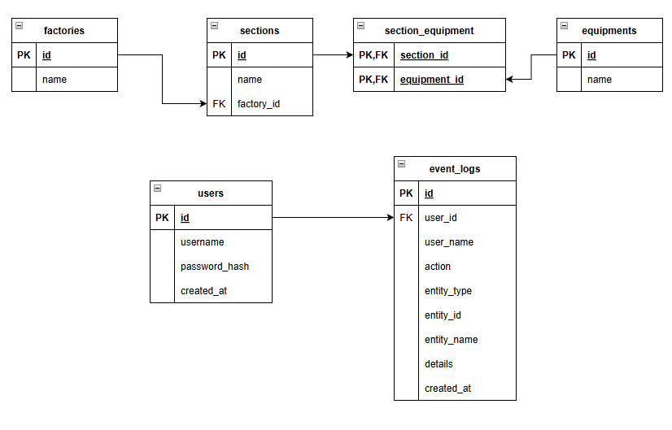

- Между сущностями Factory и Section связь один-ко-многим
- Между сущностями Section и Equipment связь многие-ко-многим, в базе данных она реализована через вспомогательную таблицу section_equipment

---

## 4. Скриншоты проекта

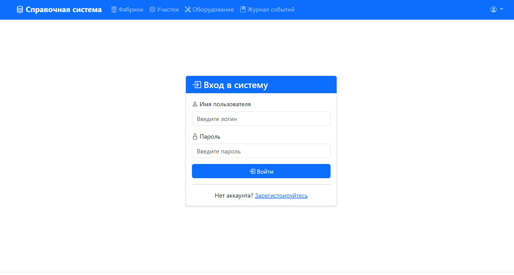
Страница входа в систему

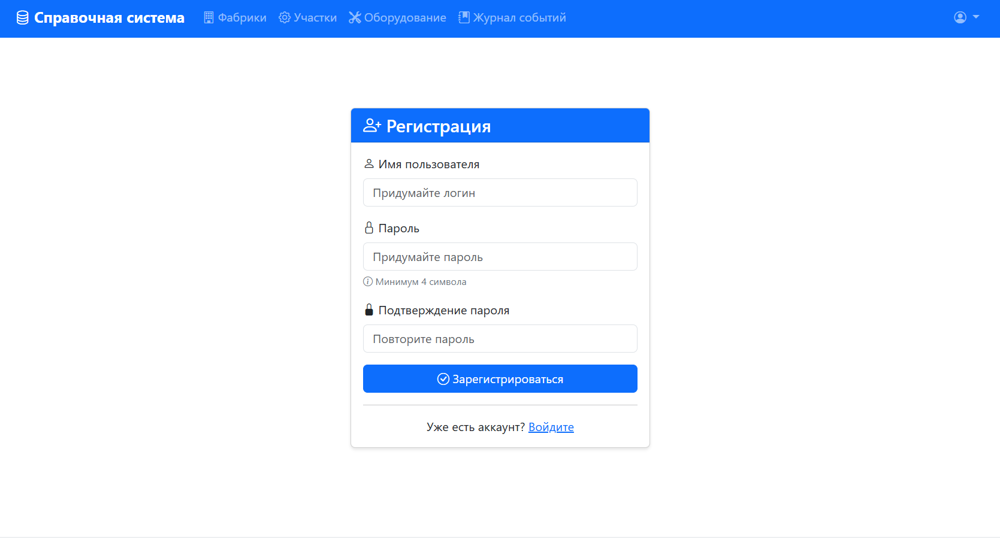
Страница регистрации

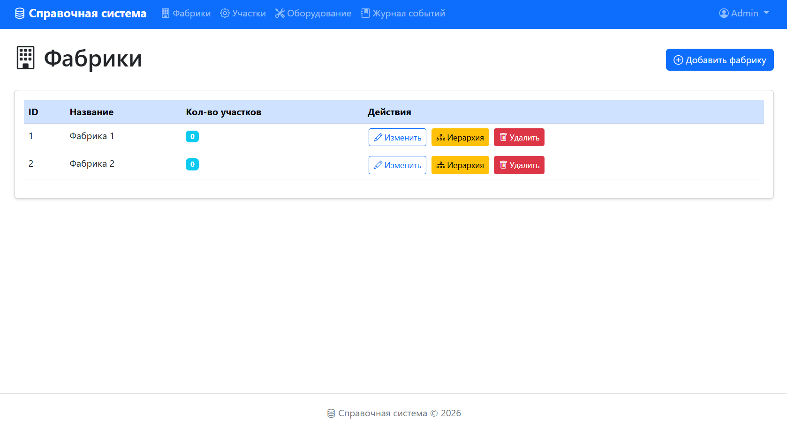
Таблица фабрик

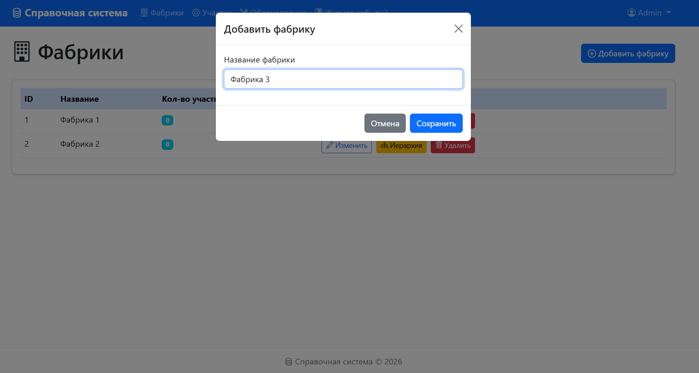
Окно добавления фабрики

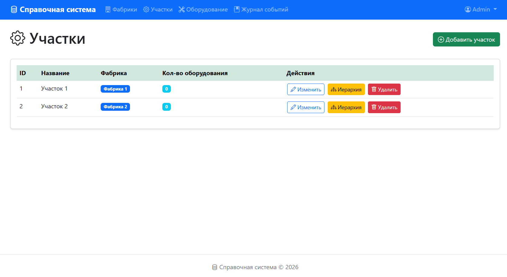
Таблица участков

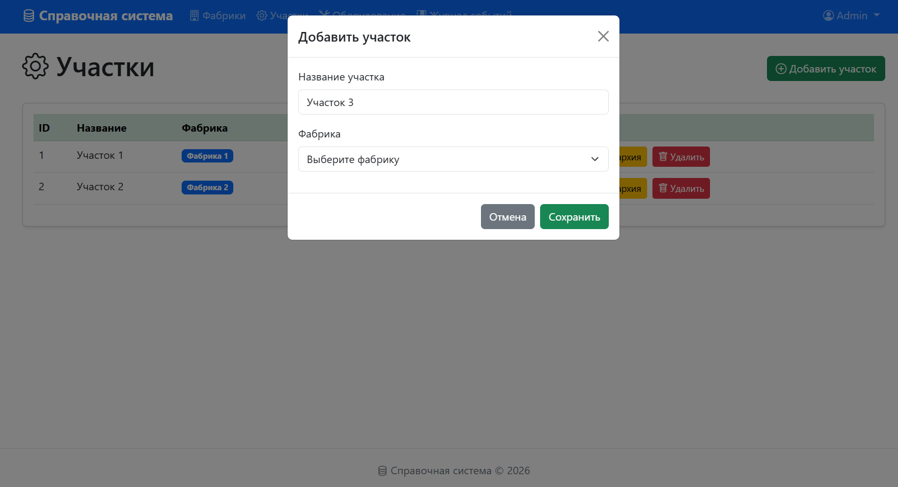
Окно добавления участка

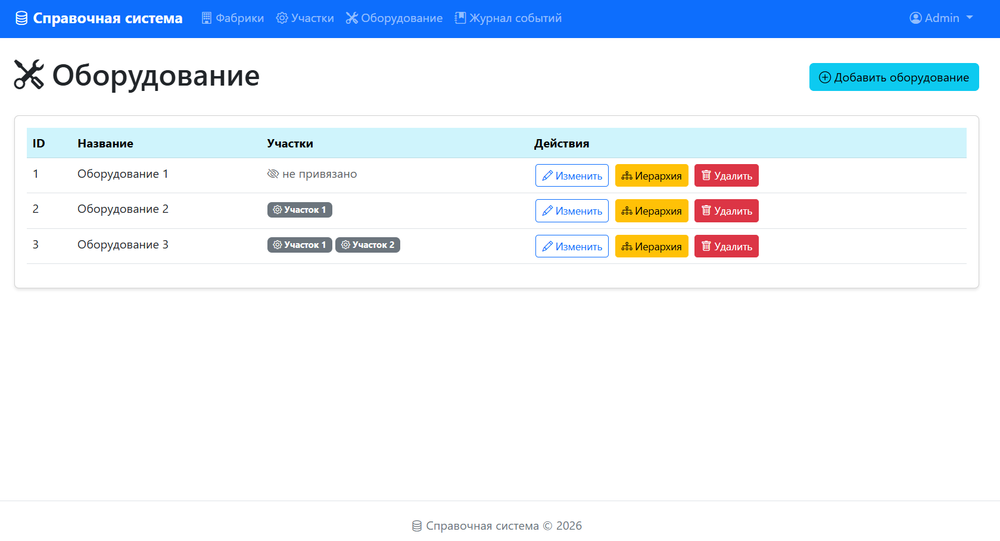
Таблица оборудования

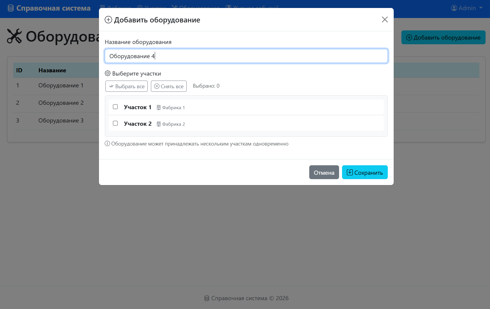
Окно добавления оборудования

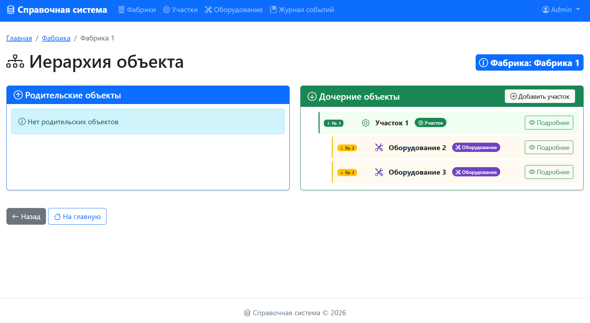
Просмотр иерархии объекта

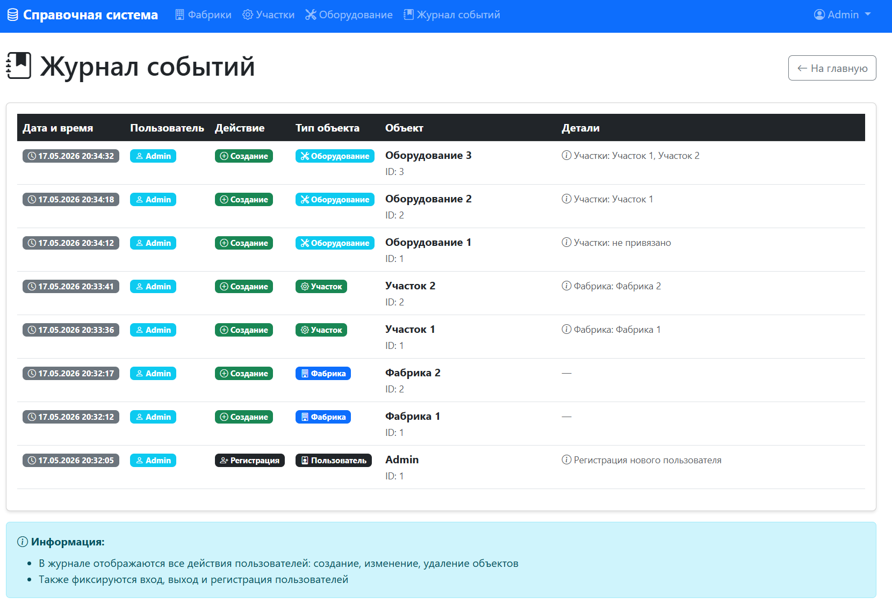
Таблица событий в системе
